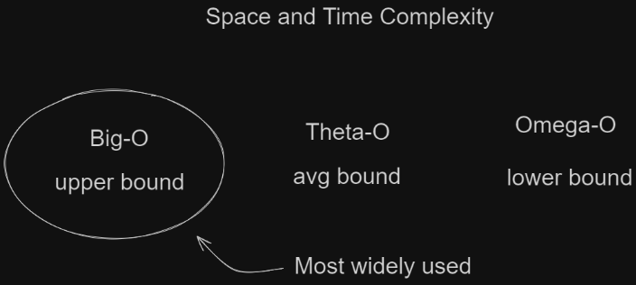

# DSA (Data Structures & Algorithms)

## Get Started

[Space And Time Complexity](#space-and-time-complexity-in-dsa)

[Data Structures](#data-structures)

- [Arrays](#arrays)
- [ArrayList](#arraylist)
- [LinkedList](#linked-list)
- [Stack](#stack)
- [Queue](#queue)
- [HashMap](#hashmap)

[Search Techniques](#search-techniques)

- [Linear Search](#linear-search)
- [Binary Search](#binary-search)

[Sorting](#sorting)

- [Bubble Sort](#bubble-sort)
- [Selection Sort](#selection-sort)

## Space and Time Complexity in DSA

In Data Structures and Algorithms (DSA), understanding the efficiency of an algorithm is crucial. This is where space and time complexity come into play.

#### Time Complexity

- **Definition:** It measures the computational cost (time taken) of an algorithm in relation to the input size.
- **Notation:** Commonly expressed using Big O notation (O()).

#### Space Complexity

- **Definition:** It measures the amount of memory space used by an algorithm in relation to the input size.
- **Notation:** Also expressed using Big O notation (O()).

**Key Points:**

- **Trade-off:** Often, there's a trade-off between time and space complexity.
- **Best, Average, and Worst Cases:** Time and space complexity can be analyzed for different scenarios.
- **Auxiliary Space:** This refers to the extra space used by an algorithm apart from the input data.

**Importance:**

- Understanding time and space complexity helps in:
  - Choosing the right algorithm for a given problem.
  - Optimizing existing algorithms.
  - Analyzing the performance of different implementations.



### What is Big O Notation?

Big O notation is a mathematical notation used to describe the limiting behavior of a function when the argument tends towards a particular value or infinity. In simpler terms, it's a way to measure the efficiency or complexity of an algorithm.

#### Time Complexity

- **Constant Time Complexity:** O(1)
- **Linear Time Complexity:** O(n)
- **Logarithmic Time Complexity:** O(log n)
- **Quadratic Time Complexity:** O(n^2)
- **Cubic Time Complexity:** O(n^3)


#### Space Complexity

Space complexity measures the amount of memory an algorithm uses to solve a problem. It's typically expressed using Big O notation.

**Factors Affecting Space Complexity:**

- Input size
- Auxiliary space

## Data Structures

### Linear Data Structures

### Arrays [^](#get-started)

Fundamental data structure used to store collections of elements of the same type.

- Linear data structure
- Homogeneous data structure
- Contiguous block of memory
- Fixed Size


**Need of Array**

- Represent data in tables/matrics
- creating queue stacks

**Declaration Of Arrays**

```
int[] arr;
// OR
int[] arr = new int[size];
```

**Initialization Of Arrays**

```
int[] arr = {1,2,3,4,5};
```

**Types Of Arrays**


**2D Array**

- reference stored can be stored in continguous location
- arrays of arrays
- column size (not mandatory)

**Declaration Of Arrays**

```
int[][] arr2d = new int[row][col];
```

**Initialization Of Arrays**

```
int[][] arr2d = {
  {1,2,3},
  {4,5,6},
  {7,8,9}
};
```

**Jagged Arrays**

- array of arrays where the inner arrays can be of different sizes
- also known as "ragged" or "irregular" array.
- 2-D array but with a variable number of columns in each row.
- Dynamic Allocation, Flexible, etc

```
int[][] arr_name = {
  {1,2,3},
  {4,5},
  {6,7,8,9}
};
```

### ArrayList [^](#get-started)

- Dynamic Size

### Linked List [^](#get-started)

- Non-contiguous memory
- Efficient insertion and deletion
- **Types:**
  - Singly Linked List
  - Doubly Linked List
  - Circular LinkedList
  - Doubly Circular Linked List

**LinkedList**


**Node**


- Scratch implementation

```
  class Node {
    int data;
    Node next;

    public Node(int value) {
        this.data = value;
        this.next = null;
    }
  }

  public class LinkedList {
    Node head;

    public LinkedList() {
        this.head = null;
    }

    public void add(int data) {
        Node newNode = new Node(data);

        if (isEmpty()) {
            head = newNode;
        } else {
            Node current = head;
            while (current.next != null) {
                current = current.next;
            }
            current.next = newNode;
        }
    }

    public String toString() {
        Node current = head;
        StringBuilder res = new StringBuilder();
        while (current != null) {
            res.append(current.data);
            if(current.next != null) {
                res.append(" --> ");
            }
            current = current.next;
        }
        return res.toString();
    }

    public boolean isEmpty() {
        if (head == null) {
            return true;
        }
        return false;
    }
  }
```

### Stack [^](#get-started)

- **Principle:** LIFO (Last In First Out)
- **Methods:**
  - push()
  - **pop()** - Returns top and pops/removes from stack
  ```
  stack.push("Hey");
  stack.push("I");
  stack.push("Am");
  stack.push("Pop");
  System.out.println(stack.pop()) //Pop
  ```
  - **peek()** - Returns first/top element of stack else NULL
  ```
  stack.push(1);
  stack.push(2);
  stack.push(3);
  stack.push(4);
  stack.push(5);
  System.out.println(stack.peek()) //5
  ```

### Queue [^](#get-started)

- **Principle:** FIFO (First In First Out)
- **Methods:** add(), offer(), enqueue(), remove(), poll(), dequeue(), peek(), isEmpty()

### HashMap [^](#get-started)

- Key and value pair
- Speed
- null is valid key or value

**Methods:**

- put(key, value)

- get(key)

- **keySet()** - Returns set containing of keys you can traverse it as well

```
cars.put("BMW", "M5");
cars.put("Mercedes", "C63");
System.out.println(cars.keySet()); // [Mercedes, BMW]
```

- **containsKey(Object key)** - (boolean) Returns true if key present or false

- **containsValue(Object value)** - (boolean) Returns true if value present or false

## Search Techniques

### Linear Search [^](#get-started)

Input **arr[]** and **target**.  
Iterates one by one using **for loop**.  
If the current element matches the target, the **index i is returned**.  
If the target is not found **-1 is returned**.

```
public static int linearSearch(int[] arr, int target) {
  for (int i = 0; i < arr.length; i++) {
      if (arr[i] == target) {
          return i; // Target found at index i
      }
  }
  return -1; // Target not found
}
```

### Binary Search [^](#get-started)

Check the value in the center of the array.  
If the target value is lower, search the left half of the array.  
If the target value is higher, search the right half.

- The array must be **sorted** for binary search to work.
- Binary search is much **faster** than linear search for large arrays.
- The time complexity of binary search is **O(log n)**.

**Avoiding Overflow** : Instead of using (start + end) / 2 (which can cause overflow if start + end is too large), it safely calculates the middle by:

```
int mid = start + (end - start) / 2;
```

## Sorting

### Bubble Sort [^](#get-started)

Also known as Sinking, Exchange, Inplace sorting algorithm.  
Swap adjacent values bubbling up highest value.  
Constant Space  
Stable Sorting Algorithm

**Time Complexity:**
Best Case: O(n) (when the array is already sorted)  
Average Case: O(n^2)  
Worst Case: O(n^2)  
Space Complexity: O(1) (in-place sorting)

```
public static void bubbleSort(int[] arr) {
        int n = arr.length;
        boolean swapped;

        for (int i = 0; i < n - 1; i++) {
            swapped = false;
            for (int j = 0; j < n - i - 1; j++) {
                if (arr[j] > arr[j + 1]) {
                    // Swap arr[j] and arr[j+1]
                    int temp = arr[j];
                    arr[j] = arr[j + 1];
                    arr[j + 1] = temp;
                    swapped = true;
                }
            }

            // If no two elements were swapped in this iteration, the array is already sorted
            if (!swapped) {
                break;
            }
        }
    }
```

### Selection Sort [^](#get-started)

Selection Sort is a comparison-based sorting algorithm. It sorts an array by repeatedly selecting the smallest (or largest) element from the unsorted portion and swapping it with the first unsorted element. This process continues until the entire array is sorted.

- comparsion based
- select smallest from unsorted and swap
- O(n) + O(n) = O(n\*n) = O(n2)
- O(1) constant space - inplace sorting
- Not stable sorting - doesn't maintain order

```
public static void selectionSort(int[] arr) {
  int n = arr.length;
  for (int i = 0; i < n - 1; i++) {
    int min_idx = i;
    for (int j = i + 1; j < n; j++) {
      if (arr[j] < arr[min_idx]) {
        min_idx = j;
      }
    }
    int temp = arr[i];
    arr[i] = arr[min_idx];
    arr[min_idx] = temp;
  }
}
```

- Insertion Sort

### Bit Manipulation

#### Decimal To Binary

- ...

#### Bitwise Operators

- **Bitwise AND (&)**
- **Bitwise OR (|)**
- **Bitwise NOT (~)**
- **Bitwise XOR (^)**

### Techniques

- ...
